## 支出流水

|费用名称|金额|状态|支出时间|Qing|Yang|
|---|---|---|---|---|---|
|八马设计费一期|7875|已付款|2023-09-23|0|7875|
|安信地板定金|2000|已付款|2023-10-04|0|2000|
|八马施工费一期|34539|已付款|2023-10-05|0|34539|
|九牧定金|5000|已付款|2023-10-06|0|5000|
|箭牌定金|4000|已付款|2023-10-06|0|4000|
|瓷砖定金|500|已付款|2023-10-06|0|500|
|铂尊门窗封阳台定金|2000|已付款|2023-10-08|0|2000|
|京东100抵扣300|100|已付款|2023-10-23|100|0|
|格力入场券|20|已付款|2023-10-27|20|0|
|空调-格力|13476|已付款|2023-10-27|0|13476|
|油烟机/燃气灶-老板|6880|已付款|2023-10-27|0|6880|
|燃气热水器-海尔|3600|已付款|2023-10-27|0|3600|
|洗碗机-海尔|5400|已付款|2023-10-27|0|5400|
|前置/净水/管线-沁园|5300|已付款|2023-10-27|301|4999|
|冰箱-海尔|6299|已付款|2023-10-29|0|6299|
|洗衣机/烘干机-海尔|8600|已付款|2023-10-29|8600|0|
|扫地机器人-石头|4299|已付款|2023-10-29|3727|572|
|铂尊门窗封阳台尾款|18020|已付款|2023-10-29|-680|18700|
|装修垃圾费|703|已付款|2023-10-30|0|703|
|卖门窗|-2020|已收款|2023-10-31|-2020|0|
|柜子定金-博洛佐尼|1000|已付款|2023-11-04|1000|0|
|改燃气|600|已付款|2023-11-21|600|0|
|窗户吊装费|1000|已付款|2023-11-23|1000|0|
|沁园管子|30|已付款|2023-11-25|30|0|
|蛇形窗帘意向金-雅琪诺|100|已付款|2023-11-26|100|0|
|空调管子-格力|1080|已付款|2023-12-01|1080|0|
|前置安装费-沁园|30|已付款|2023-12-02|30|0|
|浴霸定金-奥普|1000|已付款|2023-12-09|0|1000|
|发泡剂|14|已付款|2023-12-10|0|14|
|淋浴玻璃推拉门隔断定金-劳仑诗|1000|已付款|2023-12-17|0|1000|
|改燃气|200|已付款|2023-12-19|200|0|
|飘窗/阳台/门槛石材|500|已付款|2023-12-19|500|0|
|瓷砖尾款|3700|已付款|2023-12-19|2815|885|
|5个地漏|314|已付款|2023-12-19|314|0|
|客厅灯带及型材|770|已付款|2023-12-19|770|0|
|八马施工费二期(29605) 改水电(2289) 构造柱三根(3*300=900) 第二辆建渣外运(1200) 木饰面基层(10.5*290=3045) 打拆墙体(-600)|36439|已付款|2023-12-20|36439|0|
|TATA木门定金|1011|已付款|2023-12-24|11|1000|
|浴霸打孔|80|已付款|2023-12-25|80|0|
|瓷砖退款|-340|已收款|2023-12-29|-340|0|
|飘窗/阳台/门槛石材二期|500|已付款|2024-01-08|500|0|
|卖纸(五角一斤)灯带型材(50元)|-55|已收款|2024-01-08|-55|0|
|八马施工费三期(29605)-灯带型材(656)|28949|已付款|2024-01-09|28949|0|
|飘窗/阳台/门槛石材尾款|218|已付款|2024-01-16|218|0|
|柜子二期-博洛佐尼|39000|已付款|2024-01-23|39000|0|
|TATA木门尾款|1859|已付款|2024-01-24|1859|0|
|烟道开孔-老板|60|已付款|2024-03-02|60|0|
|测量押金(KDS押金)-已退-老板|50|已付款|2024-03-02|50|0|
|浴霸尾款-奥普|4300|已付款|2024-03-07|174|4126|
|三联门定金-德润|1000|已付款|2024-03-15|0|1000|
|三联门尾款-德润|2970|已付款|2024-03-16|0|2970|
|柜子到家尾款-博洛佐尼|9200|已付款|2024-03-18|0|9200|
|灯具(餐厅/书房/卧室)-淘宝|1768|已付款|2024-03-18|1768|0|
|帆船沙发-小半|4700|已付款|2024-03-24|0|4700|
|开关面板定金-三雄极光|500|已付款|2024-03-24|500|0|
|卖柜子的包装纸(四角一斤)|-24|已收款|2024-04-05|-24|0|
|折叠门|247|已付款|2024-04-09|247|0|
|淋浴玻璃推拉门隔断下单费-劳仑诗|1300|已付款|2024-04-11|0|1300|
|床/床头柜-小半|7570|已付款|2024-04-12|0|7570|
|折叠窗-定金|912|已付款|2024-04-12|0|912|
|筒灯-初识照明|1352|已付款|2024-04-17|1352|0|
|筒灯/感应灯-lipro|553|已付款|2024-04-17|553|0|
|箭牌尾款|2797|已付款|2024-04-18|0|2797|
|开关面板尾款-三雄极光|2063|已付款|2024-04-20|0|2063|
|灯带型材-三雄极光|1450|已付款|2024-04-20|0|1450|
|地板-安信|9000|已付款|2024-04-23|0|9000|
|补开关面板-三雄极光|405|已付款|2024-04-23|0|405|
|地板尾款-安信|474|已付款|2024-04-25|0|474|
|锯木栅-安信|100|已付款|2024-04-25|0|100|
|卖纸(三角一斤)|-6|已收款|2024-04-25|-6|0|
|阳台石材|645|已付款|2024-04-26|0|645|
|灯带安装费-20一米|640|已付款|2024-04-26|640|0|
|窗帘下单|4700|已付款|2024-04-26|0|4700|
|九牧管子延长|35|已付款|2024-04-29|35|0|
|九牧尾款|5724|已付款|2024-04-29|0|5724|
|空调接水盘+加长铜管(书房/客厅)+高空作业|665|已付款|2024-04-29|665|0|
|淋浴尾款|1370|已付款|2024-04-29|1370|0|
|玻璃胶/美容胶-瓦克|236|已付款|2024-05-01|236|0|
|镜子定金|150|已付款|2024-05-07|150|0|
|镜子尾款|200|已付款|2024-05-08|113|87|
|柜子尾款-博洛佐尼|880|已付款|2024-05-10|0|880|
|角阀/管子/双龙头-潜水艇|278|已付款|2024-05-10|278|0|
|菜盆加管子|120|已付款|2024-05-11|0|120|
|热水器加管子|60|已付款|2024-05-13|0|60|
|一个厨房三通|34|已付款|2024-05-18|34|0|
|三联门安装尾款|1000|已付款|2024-05-21|0|1000|
|傲风C3炫影-电竞椅|1004|已付款|2024-05-24|0|1004|
|傲风A4-电竞桌|1729|已付款|2024-05-24|0|1729|
|折叠窗(608+货拉拉运输28)-尾款|636|已付款|2024-05-26|0|636|
|主卧壁灯|560|已付款|2024-05-27|560|0|
|吧台壁灯|132|已付款|2024-05-27|132|0|
|入门玄关吊灯|73|已付款|2024-05-28|73|0|
|主卧面盆镜子|353|已付款|2024-05-28|353|0|
|退测量押金50元(KDS押金)-加波纹管45-老板|-5|已收款|2024-06-04|-5|0|
|玻璃胶/美容胶-瓦克|70|已付款|2024-06-09|70|0|
|两个单水龙头-潜水艇|100|已付款|2024-06-09|100|0|
|壁挂洗衣机-小吉|1559|已付款|2024-06-09|0|1559|
|甲醛试纸5盒|9|已付款|2024-06-09|9|0|
|洗碗机/洗衣机安水龙头费用|24|已付款|2024-06-09|0|24|
|折叠窗换超白|48|已付款|2024-06-11|45|3|
|飘窗打胶|100|已付款|2024-06-12|0|100|
|4个网络面板安装50元(1个10元,4个说成5个),折叠窗安装80元|130|已付款|2024-06-13|0|130|
|纱窗定金|500|已付款|2024-06-15|0|500|
|智能锁-德施曼|1168|已付款|2024-06-15|0|1168|
|主卫置物架|23.37|已付款|2024-06-18|23.37|0|
|重油污清洁剂|16.02|已付款|2024-06-18|16.02|0|
|书房垃圾桶|20.53|已付款|2024-06-18|20.53|0|
|拖把壁挂夹|13.6|已付款|2024-06-18|13.6|0|
|洁厕灵|5.8|已付款|2024-06-18|5.8|0|
|密封胶泥|11.6|已付款|2024-06-18|11.6|0|
|樟脑丸|3.9|已付款|2024-06-18|3.9|0|
|玻璃油壶|25.87|已付款|2024-06-18|25.87|0|
|甲醛清除剂|21.33|已付款|2024-06-18|21.33|0|
|马里奥挂钩|22.36|已付款|2024-06-18|22.36|0|
|棉绳|9.65|已付款|2024-06-18|9.65|0|
|肤感家具清洁剂|16.61|已付款|2024-06-18|16.61|0|
|面盆漏水塞子|11.51|已付款|2024-06-18|11.51|0|
|入户门垫|57.03|已付款|2024-06-18|57.03|0|
|纱窗清洗神器|7.2|已付款|2024-06-18|7.2|0|
|厨房垃圾桶|52.37|已付款|2024-06-18|52.37|0|
|搬家打包袋|22.81|已付款|2024-06-18|22.81|0|
|搬家打包袋|15.2|已付款|2024-06-18|15.2|0|
|手提式垃圾袋|6.3|已付款|2024-06-20|6.3|0|
|家用米桶|36.37|已付款|2024-06-20|36.37|0|
|结婚证相框|23.05|已付款|2024-06-20|23.05|0|
|化妆凳|107.28|已付款|2024-06-20|107.28|0|
|下水管遮挡盖|8.82|已付款|2024-06-20|8.82|0|
|擦玻璃专用抹布|10.49|已付款|2024-06-20|10.49|0|
|除胶剂/金属划痕清洁剂|11.53|已付款|2024-06-20|11.53|0|
|塑料衣架|10|已付款|2024-06-22|10|0|
|餐桌-小半|2596|已付款|2024-06-22|0|2596|
|餐椅(2单椅+1长椅)|720|已付款|2024-06-22|0|720|
|不沾锅-卡罗特|96|已付款|2024-06-22|0|96|
|网线钳+10个水晶头-绿联|136|已付款|2024-06-22|0|136|
|凉拖鞋女|26.99|已付款|2024-06-23|26.99|0|
|浴巾女|36.14|已付款|2024-06-23|36.14|0|
|浴袍男|90.47|已付款|2024-06-23|90.47|0|
|拖鞋男|11.04|已付款|2024-06-23|11.04|0|
|次卫地垫|42|已付款|2024-06-24|42|0|
|主卫垃圾桶|29.9|已付款|2024-06-24|29.9|0|
|次卫垃圾桶|26.9|已付款|2024-06-24|26.9|0|
|次卫厕纸盒|18.15|已付款|2024-06-24|18.15|0|
|艺术人物装饰品|14.13|已付款|2024-06-24|14.13|0|
|1个汤碗/4个斗笠碗|50.78|已付款|2024-06-24|50.78|0|
|双耳汤碗|22.8|已付款|2024-06-24|22.8|0|
|筷子/玻璃油壶|30.04|已付款|2024-06-24|30.04|0|
|开关装饰贴|30.48|已付款|2024-06-24|30.48|0|
|餐厅垃圾桶|19.9|已付款|2024-06-25|19.9|0|
|密封胶泥|12.9|已付款|2024-06-25|12.9|0|
|主卧洗脸巾收纳盒|15.16|已付款|2024-06-26|15.16|0|
|餐厅餐巾盒|9.9|已付款|2024-06-26|9.9|0|
|床头纸巾盒|5.31|已付款|2024-06-26|5.31|0|
|凉拖鞋男|17.9|已付款|2024-06-26|17.9|0|
|主卧牙刷置物架|17.95|已付款|2024-06-28|17.95|0|
|玲娜贝儿玩具|188.19|已付款|2024-06-29|188.19|0|
|床单四件套|170.9|已付款|2024-06-30|170.9|0|
|鸡蛋收纳盒|16.9|已付款|2024-06-30|16.9|0|
|乔迁之喜创意贴|2.82|已付款|2024-06-30|2.82|0|
|向日葵冰箱贴|8.88|已付款|2024-06-30|8.88|0|
|主卧地垫|99.75|已付款|2024-06-30|99.75|0|
|棉麻穿杆帘|31.01|已付款|2024-06-30|31.01|0|
|路由器2个|448.22|已付款|2024-07-01|0|448.22|
|向日葵油画|80.1|已付款|2024-07-02|80.1|0|
|厨房置物架|47.19|已付款|2024-07-02|47.19|0|
|菜板|40.08|已付款|2024-07-02|40.08|0|
|木锅铲|17.04|已付款|2024-07-02|17.04|0|
|食品保鲜袋|16.76|已付款|2024-07-02|16.76|0|
|抽屉防潮垫|8.5|已付款|2024-07-03|8.5|0|
|立邦滚筒|10.64|已付款|2024-07-03|10.64|0|
|大号垃圾袋|12.52|已付款|2024-07-03|12.52|0|
|床头垃圾桶|34.59|已付款|2024-07-03|34.59|0|
|洗脸巾/纸|128.15|已付款|2024-07-03|128.15|0|
|沐浴球|6.92|已付款|2024-07-03|6.92|0|
|吸管刷/杯具刷|11.77|已付款|2024-07-03|11.77|0|
|乔迁之喜梯子|13.33|已付款|2024-07-04|13.33|0|
|厨房地垫|92|已付款|2024-07-04|92|0|
|玻璃吸管/按压嘴|23.56|已付款|2024-07-04|23.56|0|
|长条餐布|32.7|已付款|2024-07-04|32.7|0|
|八马施工费尾款|4934|已付款|2024-07-04|0|4934|
|洗洁巾|9.9|已付款|2024-07-05|9.9|0|
|衣帽间抽屉DTC|20|已付款|2024-07-05|20|0|
|盐罐|23.88|已付款|2024-07-05|23.88|0|
|白糖罐|26.57|已付款|2024-07-05|26.57|0|
|衣架|24|已付款|2024-07-07|24|0|
|衣架|37.64|已付款|2024-07-08|37.64|0|
|防撞角|7.86|已付款|2024-07-08|7.86|0|
|冰块模具|25.68|已付款|2024-07-08|25.68|0|
|门牌号|23.26|已付款|2024-07-08|23.26|0|
|抽屉收纳盒|17.35|已付款|2024-07-08|17.35|0|
|厨房置物架|60.4|已付款|2024-07-08|60.4|0|
|一次性鞋套|6.92|已付款|2024-07-08|6.92|0|
|托盘|9.31|已付款|2024-07-08|9.31|0|
|卷纸|18.9|已付款|2024-07-08|18.9|0|
|塑料凳|124|已付款|2024-07-08|124|0|
|厨房收纳盒|18.9|已付款|2024-07-09|18.9|0|
|黑胡椒|9.7|已付款|2024-07-10|9.7|0|
|木勺|17.62|已付款|2024-07-10|17.62|0|
|衣架|48|已付款|2024-07-10|48|0|
|把手碗|17.89|已付款|2024-07-10|17.89|0|
|吸盘洗碗刷|7.85|已付款|2024-07-10|7.85|0|
|衣服收纳箱|4.83|已付款|2024-07-10|4.83|0|
|裤衣架|17.41|已付款|2024-07-10|17.41|0|
|洗碗机亮碟|107.99|已付款|2024-07-10|107.99|0|
|面条收纳盒|6.67|已付款|2024-07-11|6.67|0|
|蛇形窗帘尾款-雅琪诺(南富森)|500|已付款|2024-07-11|0|500|
|纱窗尾款|340|已付款|2024-07-11|0|340|
|餐垫|5.99|已付款|2024-07-14|5.99|0|
|汤锅-卡罗特|152.31|已付款|2024-07-15|152.31|0|
|电风扇|48.78|已付款|2024-07-15|48.78|0|
|一次性浴巾|5.8|已付款|2024-07-21|5.8|0|
|玻璃除水垢清洁剂|7.5|已付款|2024-07-22|7.5|0|
|防臭软管|75|已付款|2024-07-22|75|0|
|一次性马桶垫|5.8|已付款|2024-07-22|5.8|0|
|八马安装费用|1333|已付款|2024-07-28|249.48|1083.52|
|八马设计费尾款|7875|未付款||0|0|
|电视|0|未付款||0|0|
|打美容胶费用|0|未付款||0|0|
|塌塌米|0|未付款||0|0|
|客厅桌子|0|未付款||0|0|
|总计|337548.67|||138116.93|199431.74|

## 网线布线

查看

> HSYPVP-6A 4\*2\*0.57P CAT6A
> 4对8芯的屏蔽双绞线

**网线都是超6类且网线转角是弯角,不能是直角**
1. **弱电箱里**到**电视柜里**两根网线(**主路由器**+**IPTV**)
2. **电视柜里**到**书房书桌下**两根网线(**电脑**+**NAS**)
3. **电视柜里**到**主卧床头下**一根网线(**子路由器**)
4. **电视柜里**到**电视墙**一根网线+HDMI线(**电视机**)

综上：

弱电箱里
- 一个插座面板(光猫)

电视柜里

[弱电箱右 | 卧室] [书房左 | 书房右] [弱电箱左 | 电视]

[弱电箱右 | 未用] [书房左 | 书房右] [弱电箱左 | 卧室] 电视

- 五个插座(路由器+交换机+IPTV机顶盒+电视机)
- 三个双网口面板
  - 弱电箱到电视柜两根
  - 电视柜到书房两根
  - 电视柜到主卧床头+电视柜到电视机

书房书桌下(350mm)
- 两个插座(电脑+NAS)
- 一个双网口面板(通到电视柜里)

主卧床头下(350mm)
- 一个插座
- 一个单网口面板(通到电视柜里)

> 超六类网线的线径比普通六类线增大了0.1mm,达到0.6mm

- 交叉线(适合于电脑与电脑的连接)的接法是: 一头采用568A标准, 一头采用568B标准
- 平行直通线(适合电脑和交换机,路由器,拨号猫等连接)的接法是: 两头同为568A标准(❌)或568B标准(✔)

- 568A标准: 白绿, 绿, 白橙, 蓝, 白蓝, 橙, 白棕, 棕
- 568B标准: 白橙, 橙, 白绿, 蓝, 白蓝, 绿, 白棕, 棕

[六类水晶头的接线方法](https://zhidao.baidu.com/question/585232950.html)
[网络插座怎么接线](https://www.sohu.com/a/293118553_120043435)

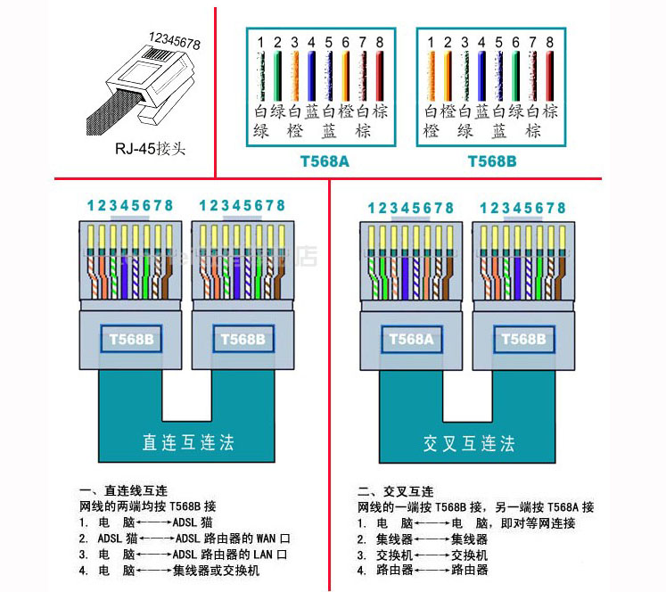

电价: 0.5224

## 水路

查看

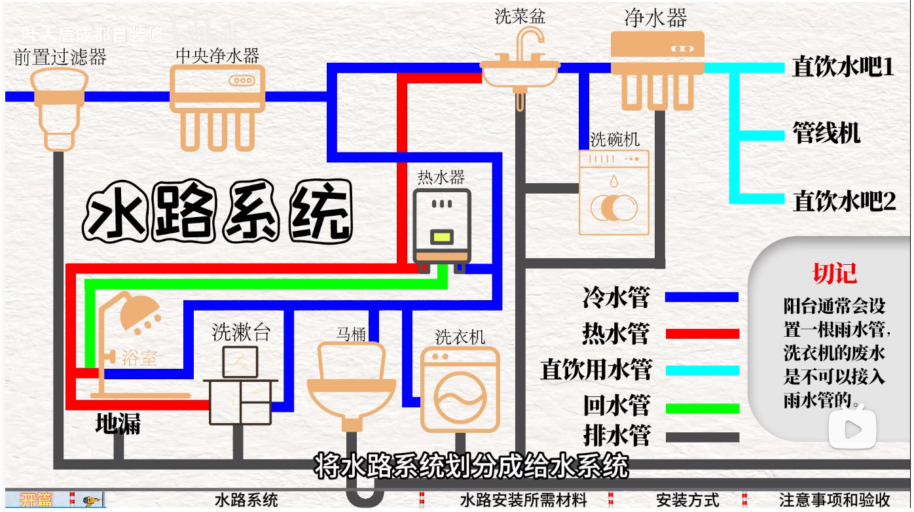

## 阳台窗帘吊顶

查看

## 支出

查看

| 费用名称 | 金额 | 型号 | 支出时间 | 青 | 羊 |
| --- | --- | --- | --- | --- | --- |
| 八马设计费一期 | 7875 | 已付款 | 2023-09-23 || 7875 |
| 安信地板定金 | 2000 | 已付款 | 2023-10-04 || 2000 |
| 八马施工费一期 | 34539 | 已付款 | 2023-10-05 || 34539 |
| 九牧定金 | 5000 | 已付款 | 2023-10-06 || 5000 |
| 箭牌定金 | 4000 | 已付款 | 2023-10-06 || 4000 |
| 瓷砖定金 | 500 | 已付款 | 2023-10-06 || 500 |
| 铂尊门窗封阳台定金 | 2000 | 已付款 | 2023-10-08 || 2000 |
| 京东100抵扣300 | 100 | 已付款 | 2023-10-23 | 100 | |
| 格力入场券 | 20 | 已付款 | 2023-10-27 | 20 | |
| 空调-格力 | 13476 | 已付款 | 2023-10-27 | | 13476 |
| 油烟机/燃气灶-老板 | 6880 | 已付款 | 2023-10-27 | | 6880 |
| 燃气热水器-海尔 | 3600 | 已付款 | 2023-10-27 | | 3600 |
| 洗碗机-海尔 | 5400 | 已付款 | 2023-10-27 || 5400 |
| 前置/净水/管线-沁园 | 5300 | 已付款 | 2023-10-27 | 301 | 4999 |
| 冰箱-海尔 | 6599 | 已付款 | 2023-10-29 | 6599 ||
| 洗衣机/烘干机-海尔 | 8600 | 已付款 | 2023-10-29 | 8600 ||
| 扫地机器人-石头 | 4299 | 已付款 | 2023-10-29 | 3727 | 572 |
| 铂尊门窗封阳台尾款 | 18020 | 已付款 | 2023-10-29 | -680 | 18700 |
| 装修垃圾费 | 703 | 已付款 | 2023-10-30 | | 703 |
| 卖门窗 | -2020 | 已收款 | 2023-10-31 | -2020 | |
| 柜子定金-博洛佐尼 | 1000 | 已付款 | 2023-11-04 | 1000 | |
| 改燃气 | 600 | 已付款 | 2023-11-21 | 600 | |
| 窗户吊装费 | 1000 | 已付款 | 2023-11-23 | 1000 | |
| 沁园管子 | 30 | 已付款 | 2023-11-25 | 30 | |
| 窗帘意向金-雅琪诺 | 100 | 已付款 | 2023-11-26 | 100 | |
| 空调管子-格力 | 1080 | 已付款 | 2023-12-01 | 1080 | |
| 前置安装费-沁园 | 30 | 已付款 | 2023-12-02 | 30 | |
| 浴霸定金-奥普 | 1000 | 已付款 | 2023-12-09 | | 1000 |
| 发泡剂 | 14 | 已付款 | 2023-12-10 | | 14 |
| 淋浴玻璃推拉门隔断 | 1000 | 已付款 | 2023-12-17 | | 1000 |
| 改燃气 | 200 | 已付款 | 2023-12-19 | 200 | |
| 飘窗/阳台/门槛石材 | 500 | 已付款 | 2023-12-19 | 500 | |
| 瓷砖尾款 | 3700 | 已付款 | 2023-12-19 | 2815 | 885 |
| 5个地漏 | 314 | 已付款 | 2023-12-19 | 314 | |
| 客厅灯带及型材 | 770 | 已付款 | 2023-12-19 | 770 | |
| 八马施工费二期(29605) 改水电(2289) 构造柱三根(3\*300=900) 第二辆建渣外运(1200) 木饰面基层(10.5\*290=3045) 打拆墙体(-600) | 36439 | 已付款 | 2023-12-20 | 36439 | |
| TATA木门定金 | 1011 | 已付款 | 2023-12-24 | 11 | 1000 |
| 浴霸打孔 | 80 | 已付款 | 2023-12-25 | 80 | |
| 瓷砖退款 | -340 | 已收款 | 2023-12-29 | -340 | |
| 飘窗/阳台/门槛石材二期 | 500 | 已付款 | 2024-01-08 | 500 | |
| 卖废品 | -55 | 已收款 | 2024-01-08 | -55 | |
| 八马施工费三期(29605)-灯带型材(656) | 28949 | 已付款 | 2024-01-09 | 28949 | |
| 飘窗/阳台/门槛石材尾款 | 218 | 已付款 | 2024-01-16 | 218 | |
| 柜子二期-博洛佐尼 | 39000 | 已付款 | 2024-01-23 | 39000 | |
| TATA木门尾款 | 1859 | 已付款 | 2024-01-24 | 1859 | |
| 烟道开孔-老板 | 60 | 已付款 | 2024-03-02 | 60 | |
| 测量押金(KDS押金)-要退-老板 | 50 | 已付款 | 2024-03-02 | 50 | |
| 浴霸尾款-奥普 | 4300 | 已付款 | 2024-03-07 | 174.17 | 4125.83 |
| 三联门定金-德润 | 1000 | 已付款 | 2024-03-15 | | 1000 |
| 三联门尾款-德润 | 2970 | 已付款 | 2024-03-16 | | 2970 |
| 柜子到家尾款-博洛佐尼 | 9200 | 已付款 | 2024-03-18 | | 9200 |
| 灯具-淘宝 | 3000 | 已付款 | 2024-03-18 | 3000 | |
| 床/床头柜/餐桌/凳子-源氏木语 | 12243 | 已付款 | 2024-03-23 | 12243 | |
| 帆船沙发-小半 | 4870 | 已付款 | 2024-03-24 | 4870 | |
| 开关面板定金-三雄极光 | 500 | 已付款 | 2024-03-24 | 500 | |
| 柜子尾款-博洛佐尼 | 1000 | 未付款 | | | |
| 开关面板尾款-三雄极光 | | 未付款 | | | |
| 八马施工费尾款 | | 未付款 | | | |
| 八马设计费尾款 | | 未付款 | | | |
| 支出小计 | 284083 ||| 152644.17 | 131438.83 |

## 定制

| 名称 | 厂家 | 金额 | 地址链接 | 参数 | 安装方式 | 图片 |
| --- | --- | --- | --- | --- | --- | --- |
| 设计 | 八马 | 15750 | [百度地图](https://j.map.baidu.com/b2/tHTK) | 一期7875 | - | - |
| 半包 | 八马 | 100000 | [百度地图](https://j.map.baidu.com/b2/tHTK) | 一期34539 | - | - |
| 封窗 | 铂尊 | - | [百度地图](https://j.map.baidu.com/1b/KlTK) | 定金2000 | - | - |
| 地板 | 安信 | 11000 | [百度地图](https://j.map.baidu.com/ab/p1qK) | 定金2000 | - | - |
| 瓷砖 | 王者 | - | - | 定金500 | - | - |
| 窗帘 | - | - | - | - | - | - |
| 衣柜+书柜+厨柜 | - | - | - | - | - | - |

## 家电
| 名称 | 厂家 | 型号 | 操作 |
| --- | --- | --- | --- | --- |
| 空调 | 格力 | - | [`参数`](#空调-参数),[`查看`](#空调-查看) |
| 冰箱 | 海尔 | - | [`参数`](#冰箱-参数),[`查看`](#冰箱-查看) |
| 洗衣机 | 松下 | - | [`参数`](#洗衣机-参数),[`查看`](#洗衣机-查看) |
| 烘干机 | 松下 | - | [`参数`](#烘干机-参数),[`查看`](#烘干机-查看) |
| 洗碗机 | 美的 | - | [`参数`](#洗碗机-参数),[`查看`](#洗碗机-查看) |
| 热水器 | 美的 | - | [`参数`](#热水器-参数),[`查看`](#热水器-查看) |
| 燃气灶 | 老板 | - | [`参数`](#燃气灶-参数),[`查看`](#燃气灶-查看) |
| 油烟机 | 老板 | - | [`参数`](#油烟机-参数),[`查看`](#油烟机-查看) |
| 管线机 | 沁园 | - | [`参数`](#管线机-参数),[`查看`](#管线机-查看) |
| 净水器 | 沁园 | - | [`参数`](#净水器-参数),[`查看`](#净水器-查看) |
| 前置过滤器 | 沁园 | - | [`参数`](#前置过滤器-参数),[`查看`](#前置过滤器-查看) |
| 扫地机器人 | 石头 | p40pro | [`参数`](#扫地机器人-参数),[`查看`](#扫地机器人-查看) |
| 洗袜机 | - | - | [`参数`](#洗袜机-参数),[`查看`](#洗袜机-查看)|
| 浴霸 | - | - | - |
| 床 | - | - | - |
| 沙发 | - | - | - |
| 电视 | - | - | - |

## 卫浴用具
| - | - | - | - | - |
| --- | --- | --- | --- | --- |
| 主卫浴室柜+镜 | 九牧 | 4766 | - | - | - |
| 主卫智能马桶 | 箭牌 | 2999 | - | - | - |
| 主卫花洒 | 箭牌 | 1600 | - | - | - |
| 次卫浴室柜+镜 | 箭牌 | 3100 | 换抽拉龙头 | - | - |
| 次卫蹲便 | 九牧 | 649 | - | - | [`jump`](#次卫蹲便) |
| 次卫花洒 | 九牧 | 299 | - | - | - |
| 菜盆 | 九牧 | 3182 | - | - | - |
| 晾衣架 | 九牧 | 2428 | - | - | - |
| - | - | - | - | - | - |
| - | 九牧 | 定金5000 | - | - | - |
| - | 箭牌 | 定金4000 | - | - | - |
| - | - | - | - | - | - |
| 插座面板 | - | - | - | - | - |
| 壁灯 | - | - | - | - | - |
| 灯带 | - | - | - | - | - |
| 地漏 | - | - | - | - | - |
| 铝扣板 | - | - | - | - | 厨房顶部 |
| - | - | - | - | - | - |

**九牧满减: 4766+649+299+3182+2428-600=10724**

### 次卫蹲便

**[`返回`](#卫浴用具)**

查看图片

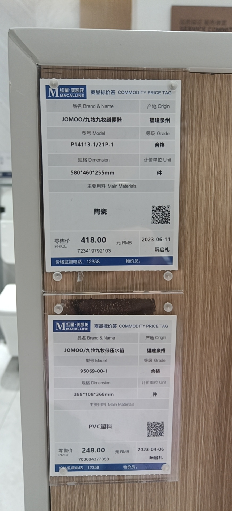

## 家电-参数

### 空调-参数

### 冰箱-参数

**[`返回`](#家电)**

查看

- 尺寸
- 分区
- 制冷方式
  - ~~直冷~~
  - 风冷✔
  - 风直混冷
- 循环系统
- 定频/变频: 变频耗电低噪音小
- 能效等级: 选一级能效
- 保鲜方式
- 其他
  - 杀细除臭
  - 制冰

#### 循环系统

一个循环系统是指一个风机配一个蒸发器

- 单循环是指整个冰箱用同一个循环系统,容易串味
- 双循环是指冷藏室和冷冻室分别用一个循环系统
- 三循环: 冷藏室 冷冻室 变温室 分别用一个循环系统

### 油烟机-参数

**[`返回`](#家电)**

查看

- 风量
- 风压
- 吸烟口位置

#### 风量

风量越大吸烟越强,但噪音也越大,一般 20立方/分钟

#### 风压

风压越大抗倒风能力越强,最大静压 300~400pa

#### 吸烟口位置

欧式,中式,顶吸,**侧吸**,7字吸

自清洁,单向排烟

### 燃气灶-参数

**[`返回`](#家电)**

- 热负载
- 热效率(能效等级:一级)

### 洗碗机-参数

**[`返回`](#家电)**

查看

- 类型
  - 嵌入式✔
  - 水槽式: 不用弯腰,但容量小不易维修
  - ~~独立式~~: 新房装修不考虑
- 洗涤方式
  - 喷淋式✔
  - ~~超声波式~~: 太贵不考虑
- 烘干方式
  - 冷凝
  - 热交换
  - 热风烘干✔
  - 晶蕾烘干
- 容量
  - 12套足够

### 洗衣机-参数

**[`返回`](#家电)**

查看

- 洗净原理
  - 滚桶
  - 波轮
- 电机
  - BLDC电机
    - 直驱传动: 噪音小,精度高✔
    - 皮带传动
- 容量: 10kg
- 洗净比
- 其他
  - 杀菌

### 烘干机-参数

**[`返回`](#家电)**

- 烘干方式
  - 冷凝式
  - 直排式
  - 热泵式: 可以即烘即穿✔
- 容量

### 热水器-参数

**[`返回`](#家电)**

查看

- 升数: 加热25度后每分钟的出水量, 13升足够
- 水箱材质
  - ~~不锈钢~~
  - 无氧铜 ✔
  - 磷脱氧铜
- 是否恒温
  - ~~燃气比例阀~~
  - 水气双调 ✔
  - 水量伺服器
- 零冷水 ✔
- 排烟方式
  - ~~烟道式~~
  - 墙排式 ✔
  - 平衡式

## 家电-查看

### 空调-查看

#### 格力

13456元

#### 美的

总价12600, 换无风感 14000

**客厅**
**[`返回`](#家电)**

- 价格: 6899
- 型号: KFR-72LW/BDN8Y-YC301(1)A
- 制冷量: 3匹
- 系列: 智行

查看图片

- 价格: 7899
- 型号: KFR-72LW/BDN8Y-YB308(1)A
- 制冷量: 3匹
- 系列: 舒适星

查看图片

**书房**
**[`返回`](#家电)**

- 价格: 2199
- 制冷量: 1匹
- 系列: 冷静星

查看图片

**主卧**
**[`返回`](#家电)**

- 价格: 4099
- 制冷量: 3匹
- 系列: 风语者

查看图片

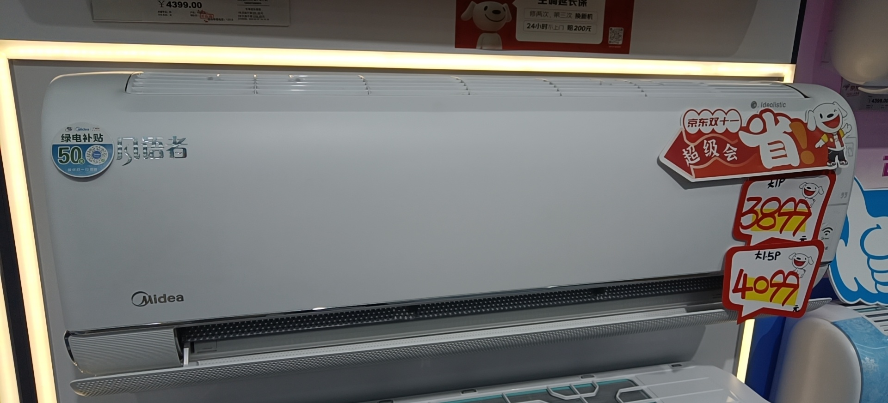

- 价格: 3999
- 制冷量: 3匹
- 型号: KFR-35GW/CA1Z

查看图片

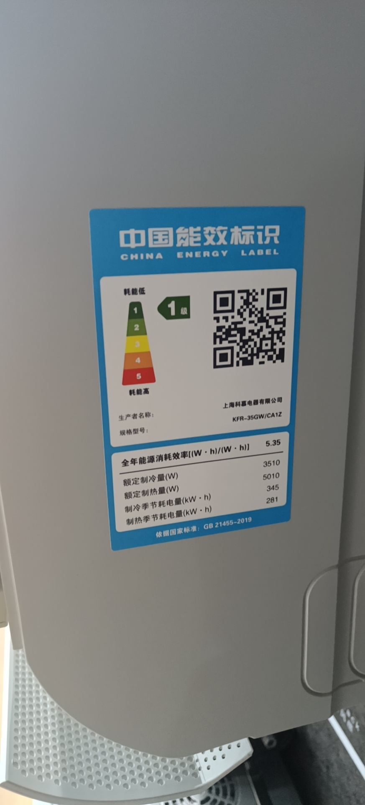
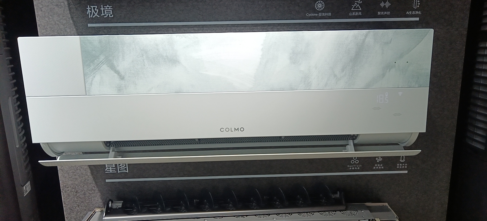

### 冰箱-查看

#### 海尔
**[`返回`](#家电)**

- 价格: 6500
- 型号: BCD-505WGHTD14GXU1

查看图片

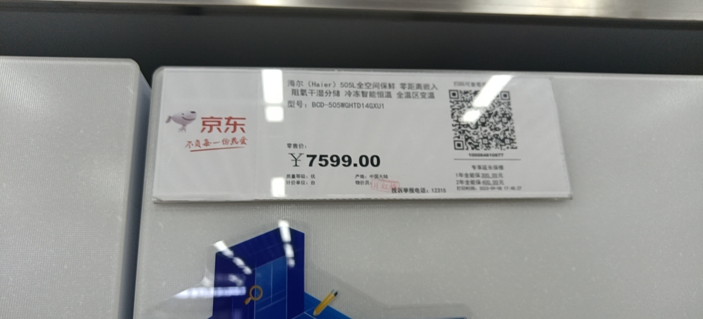

- 价格: 7499
- 型号: BCD-506WGHTD14S3U1

查看图片

### 油烟机-查看

#### 老板
**[`返回`](#家电)**

- 油烟机+燃气灶: 5318

查看图片

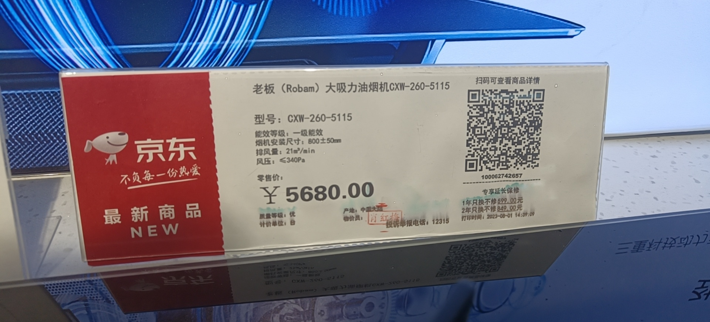

- 油烟机+燃气灶: 6280

查看图片

#### 方太
**[`返回`](#家电)**

- 油烟机+燃气灶: 7300
- 油烟机型号: CXW-358-Z7T
- 风量: 20立方/分钟
- 风压: >=1000Pa

查看图片

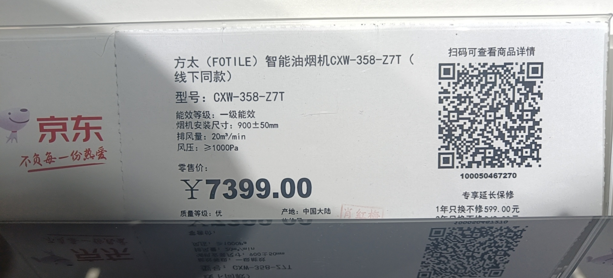

### 燃气灶-查看

#### 老板
**[`返回`](#家电)**

- 油烟机+燃气灶: 5318

查看图片

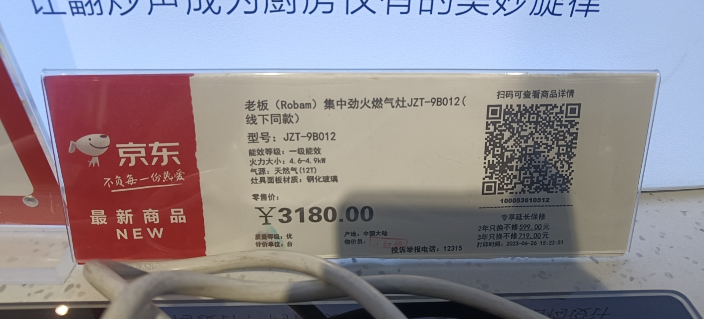

- 油烟机+燃气灶: 6280

查看图片

#### 方太
**[`返回`](#家电)**

查看图片

- 油烟机+燃气灶: 7300
- 燃气灶型号: JZT-01-TD7B-12T

### 洗碗机-查看

#### 美的
**[`返回`](#家电)**

15套共6000元,送3套耗材 能洗一年,6年保修.如果加燃气热水器能5000.

- 价格: 6000
- 型号: S62-T
- 防水等级: IPX1
- 系列: 智行

查看图片

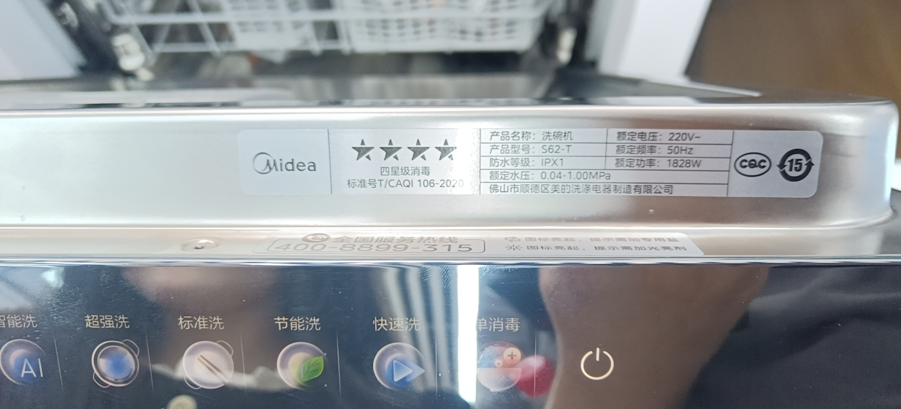

#### 老板
**[`返回`](#家电)**

12套5000,管子免费加到3米

### 洗衣机-查看

#### 海尔
**[`返回`](#家电)**

加[`海尔烘干机`](#烘干机-查看)一共9000

- 型号: XQG100-B14376LU1

查看图片

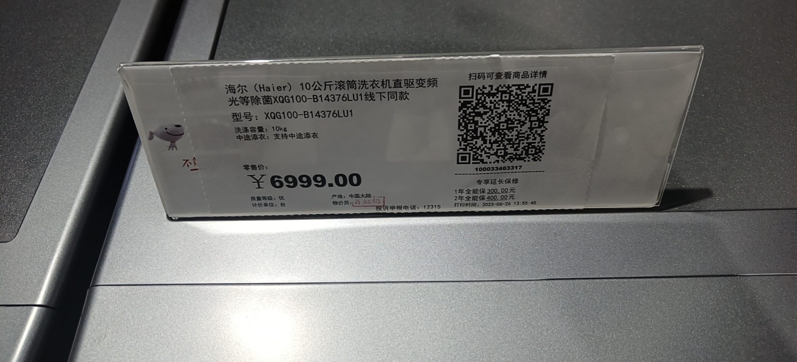
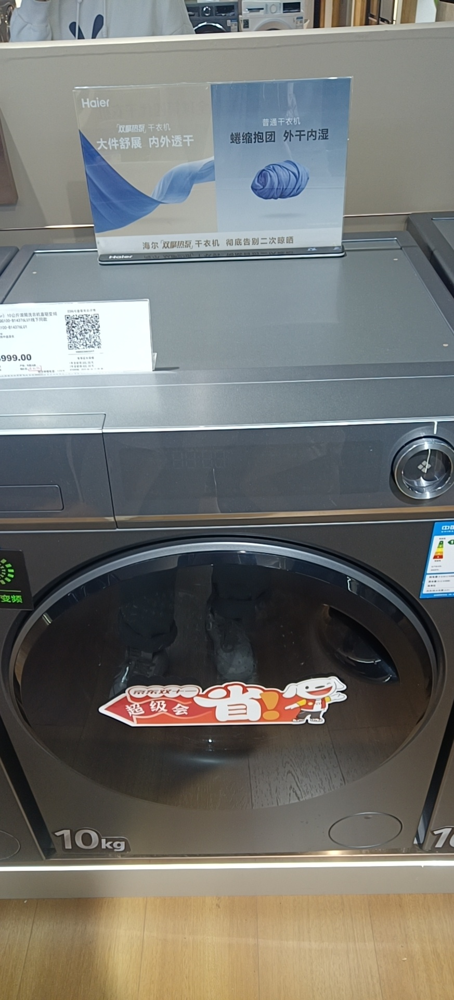

#### 小天鹅
**[`返回`](#家电)**

加[`小天鹅烘干机`](#烘干机-查看)一共7499

42度烘干

查看图片

### 烘干机-查看

#### 海尔
**[`返回`](#家电)**

加[`海尔洗衣机`](#洗衣机-查看)一共9000

- 型号: HGY100-F376U1

查看图片

#### 小天鹅
**[`返回`](#家电)**

加[`小天鹅洗衣机`](#洗衣机-查看)一共7499

查看图片

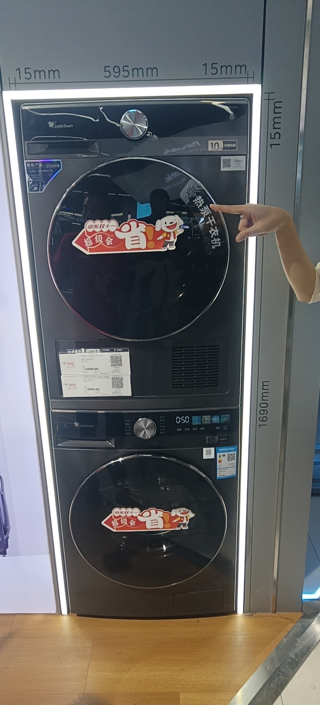

### 管线机-查看

#### 美的
**[`返回`](#家电)**

管线机+净水器+前置过滤器(赠)=5430元

- 型号: CWG-DA03

查看图片

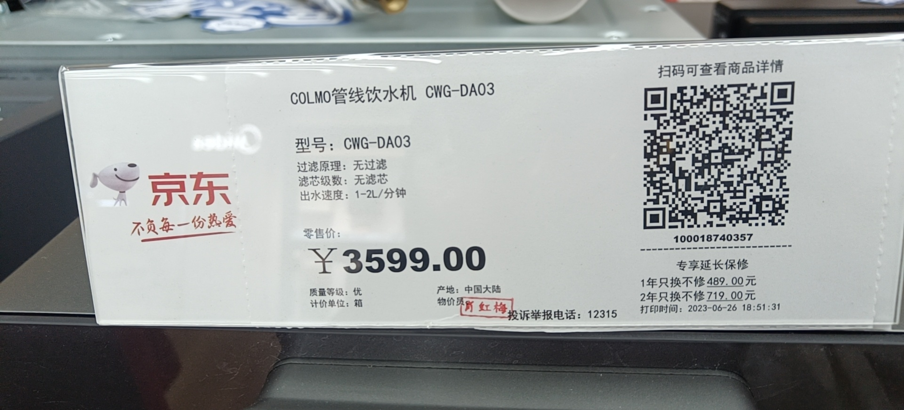
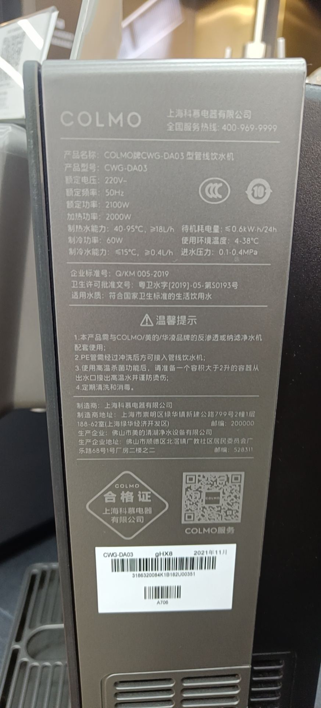

#### 沁园
**[`返回`](#家电)**

管线机+净水器+前置过滤器=5600元

小滤芯140一根,大滤芯89百一根

### 净水器-查看

#### 美的
**[`返回`](#家电)**

管线机+净水器+前置过滤器(赠)=5430元

- 型号: CWRC500-B103

查看图片

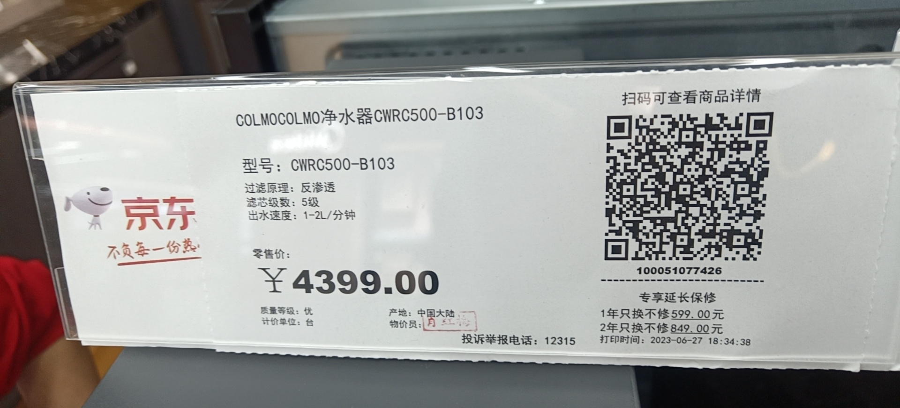

#### 沁园
**[`返回`](#家电)**

管线机+净水器+前置过滤器=5600元

小滤芯140一根,大滤芯89百一根

### 前置过滤器-查看

#### 美的
**[`返回`](#家电)**

管线机+净水器+前置过滤器(赠)=5430元

- 型号: CWQZ-A22

查看图片

#### 沁园
**[`返回`](#家电)**

管线机+净水器+前置过滤器=5600元

小滤芯140一根,大滤芯89百一根

### 热水器-查看

#### 美的
**[`返回`](#家电)**

8年保修,如果加[`洗碗机`](#洗碗机-查看)能5000.

- 型号: JSQ30-16QM4

查看图片

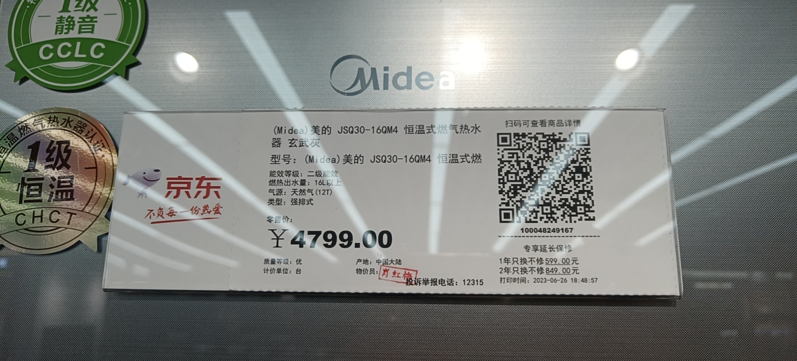

### 洗袜机-查看

#### 海尔
**[`返回`](#家电)**

- 价格: 2000多
- 型号:

查看图片

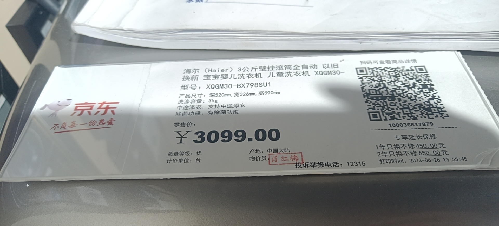
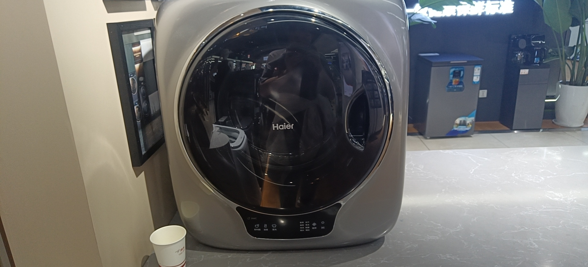

## 甲醛

- 溶于水: 窗帘等收到后洗一遍
- 通风

## 品牌推荐

- 海尔: 冰箱,洗衣机
- 格力: 空调
- 美的: 洗碗机
- 方太,老板: 烟机灶具
- 凯迪仕: 智能锁
