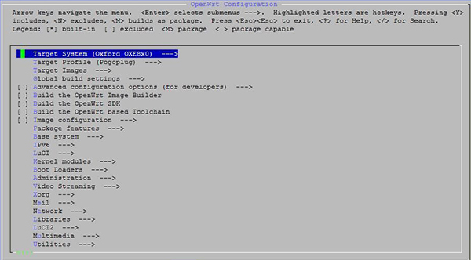

[参考链接](https://zhidx.com/p/186.html)

1. 安装Ubuntu
2. 安装工具
```bash
sudo apt-get install g++ libncurses5-dev zlib1g-dev bison flex unzip autoconf gawk make gettext gcc binutils patch bzip2 libz-dev asciidoc subversion sphinxsearch libtool sphinx-common
```
3. 下载OpenWrt源码并编译
```bash
mkdir openwrt
sudo chmod 777 openwrt
cd openwrt

svn co svn://svn.openwrt.org/openwrt/branches/backfire/
# https://github.com/openwrt/openwrt.git
cp feeds.conf.default feeds.conf
./scripts/feeds update -a
./scripts/feeds install -a

make defconfig
make menuconfig
```
4. 配置



5. 编译
```bash
make -j V=99
```
